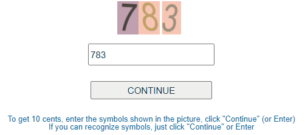

# Referral Scam Website Captcha Bot
## a.k.a. [Eqmoney](http://eqmoney.xyz) / [Eoqmoney](http://eoqmoney.xyz/help.php) Captcha Exploit
These websites use an identical script and almost identical name to run one of the usual referral scams where people need to refer big amounts of new victims while viewing advertisements and being asked to buy referrals by sending Bitcoins to the scammer.
While solving fake captchas for money while viewing ads might seem like fair trade, none of the users is ever able to withdraw the balance.  

  
This bot assists with solving fake captchas on referral scam websites to reveal quicker what this scam is about.

While the website is not suffering from using this script, it still proves in just a few lines of code that the captcha is a farce (captcha visible from taking a look at the markup).
The only options seem to be taking legal action or spamming the database with new registrations until the website stops working.
I believe the balance is just a counter and not an accumulated amount from separate data entries.

## Installation
Make sure to have Tampermonkey/Greasemonkey/Violentmonkey installed, then click [here](https://raw.githubusercontent.com/gekkedev/referral-scam-captcha-bot/master/captchabot.user.js) and confirm your intention to install the Userscript.

## Contributing
Feel free to submit any pull requests with additional links (likely a lot of compatible websites using the same script exist).
